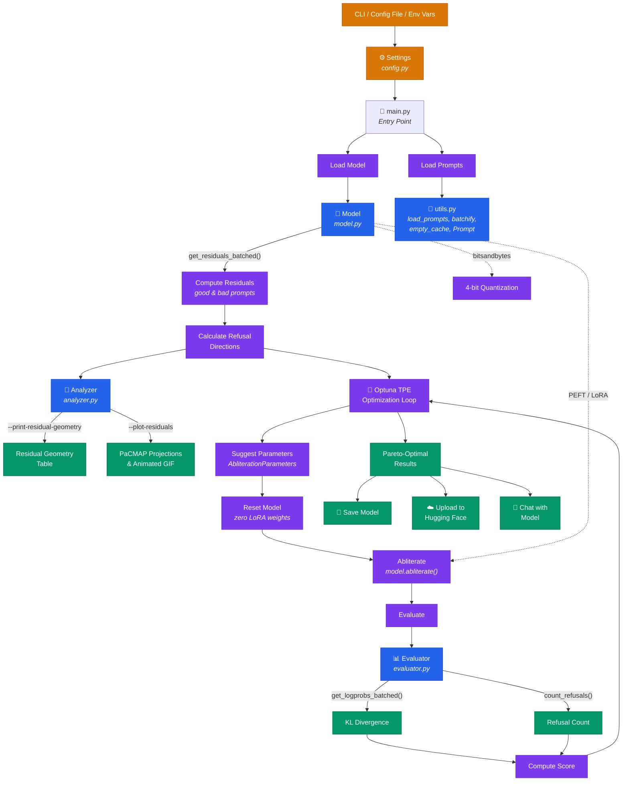

# Heretic: Fully automatic censorship removal for language models<br><br>[](https://discord.gg/gdXc48gSyT) [](https://huggingface.co/heretic-org)

Heretic is a tool that removes censorship (aka "safety alignment") from
transformer-based language models without expensive post-training.
It combines an advanced implementation of directional ablation, also known
as "abliteration" ([Arditi et al. 2024](https://arxiv.org/abs/2406.11717),
Lai 2025 ([1](https://huggingface.co/blog/grimjim/projected-abliteration),
[2](https://huggingface.co/blog/grimjim/norm-preserving-biprojected-abliteration))),
with a TPE-based parameter optimizer powered by [Optuna](https://optuna.org/).

This approach enables Heretic to work **completely automatically.** Heretic
finds high-quality abliteration parameters by co-minimizing the number of
refusals and the KL divergence from the original model. This results in a
decensored model that retains as much of the original model's intelligence
as possible. Using Heretic does not require an understanding of transformer
internals. In fact, anyone who knows how to run a command-line program
can use Heretic to decensor language models.


&nbsp;

Running unsupervised with the default configuration, Heretic can produce
decensored models that rival the quality of abliterations created manually
by human experts:

| Model | Refusals for "harmful" prompts | KL divergence from original model for "harmless" prompts |
| :--- | ---: | ---: |
| [google/gemma-3-12b-it](https://huggingface.co/google/gemma-3-12b-it) (original) | 97/100 | 0 *(by definition)* |
| [mlabonne/gemma-3-12b-it-abliterated-v2](https://huggingface.co/mlabonne/gemma-3-12b-it-abliterated-v2) | 3/100 | 1.04 |
| [huihui-ai/gemma-3-12b-it-abliterated](https://huggingface.co/huihui-ai/gemma-3-12b-it-abliterated) | 3/100 | 0.45 |
| **[p-e-w/gemma-3-12b-it-heretic](https://huggingface.co/p-e-w/gemma-3-12b-it-heretic) (ours)** | **3/100** | **0.16** |

The Heretic version, generated without any human effort, achieves the same
level of refusal suppression as other abliterations, but at a much lower
KL divergence, indicating less damage to the original model's capabilities.
*(You can reproduce those numbers using Heretic's built-in evaluation functionality,
e.g. `heretic --model google/gemma-3-12b-it --evaluate-model p-e-w/gemma-3-12b-it-heretic`.
Note that the exact values might be platform- and hardware-dependent.
The table above was compiled using PyTorch 2.8 on an RTX 5090.)*

Of course, mathematical metrics and automated benchmarks never tell the whole
story, and are no substitute for human evaluation. Models generated with
Heretic have been well-received by users (links and emphasis added):

> "I was skeptical before, but I just downloaded
> [**GPT-OSS 20B Heretic**](https://huggingface.co/p-e-w/gpt-oss-20b-heretic)
> model and holy shit. It gives properly formatted long responses to sensitive topics,
> using the exact uncensored words that you would expect from an uncensored model,
> produces markdown format tables with details and whatnot. Looks like this is
> the best abliterated version of this model so far..."
> [*(Link to comment)*](https://old.reddit.com/r/LocalLLaMA/comments/1oymku1/heretic_fully_automatic_censorship_removal_for/np6tba6/)

> "[**Heretic GPT 20b**](https://huggingface.co/p-e-w/gpt-oss-20b-heretic)
> seems to be the best uncensored model I have tried yet. It doesn't destroy a
> the model's intelligence and it is answering prompts normally would be
> rejected by the base model."
> [*(Link to comment)*](https://old.reddit.com/r/LocalLLaMA/comments/1oymku1/heretic_fully_automatic_censorship_removal_for/npe9jng/)

> "[[**Qwen3-4B-Instruct-2507-heretic**](https://huggingface.co/p-e-w/Qwen3-4B-Instruct-2507-heretic)]
> Has been the best unquantized abliterated model that I have been able to run on 16gb vram."
> [*(Link to comment)*](https://old.reddit.com/r/LocalLLaMA/comments/1phjxca/im_calling_these_people_out_right_now/nt06tji/)

Heretic supports most dense models, including many multimodal models, and
several different MoE architectures. It does not yet support SSMs/hybrid models,
models with inhomogeneous layers, and certain novel attention systems.

You can find a small collection of models that have been decensored using Heretic
[on Hugging Face](https://huggingface.co/collections/p-e-w/the-bestiary),
and the community has created and published
[well over 1,000](https://huggingface.co/models?other=heretic)
Heretic models in addition to those.


## Usage

Prepare a Python 3.10+ environment with PyTorch 2.2+ installed as appropriate
for your hardware. Then run:

```
pip install -U heretic-llm
heretic Qwen/Qwen3-4B-Instruct-2507
```

Replace `Qwen/Qwen3-4B-Instruct-2507` with whatever model you want to decensor.

The process is fully automatic and does not require configuration; however,
Heretic has a variety of configuration parameters that can be changed for
greater control. Run `heretic --help` to see available command-line options,
or look at [`config.default.toml`](config.default.toml) if you prefer to use
a configuration file.

At the start of a program run, Heretic benchmarks the system to determine
the optimal batch size to make the most of the available hardware.
On an RTX 3090, with the default configuration, decensoring Llama-3.1-8B-Instruct
takes about 45 minutes. Note that Heretic supports model quantization with
bitsandbytes, which can drastically reduce the amount of VRAM required to process
models. Set the `quantization` option to `bnb_4bit` to enable quantization.

After Heretic has finished decensoring a model, you are given the option to
save the model, upload it to Hugging Face, chat with it to test how well it works,
or any combination of those actions.


## Research features

In addition to its primary function of removing model censorship, Heretic also
provides features designed to support research into the semantics of model internals
(interpretability). To use those features, you need to install Heretic with the
optional `research` extra:

```
pip install -U heretic-llm[research]
```

This gives you access to the following functionality:

### Generate plots of residual vectors by passing `--plot-residuals`

When run with this flag, Heretic will:

1. Compute residual vectors (hidden states) for the first output token,
   for each transformer layer, for both "harmful" and "harmless" prompts.
2. Perform a [PaCMAP projection](https://github.com/YingfanWang/PaCMAP)
   from residual space to 2D-space.
3. Left-right align the projections of "harmful"/"harmless" residuals
   by their geometric medians to make projections for consecutive layers
   more similar. Additionally, PaCMAP is initialized with the previous
   layer's projections for each new layer, minimizing disruptive transitions.
4. Scatter-plot the projections, generating a PNG image for each layer.
5. Generate an animation showing how residuals transform between layers,
   as an animated GIF.


See [the configuration file](config.default.toml) for options that allow you
to control various aspects of the generated plots.

Note that PaCMAP is an expensive operation that is performed on the CPU.
For larger models, it can take an hour or more to compute projections
for all layers.

### Print details about residual geometry by passing `--print-residual-geometry`

If you are interested in a quantitative analysis of how residual vectors
for "harmful" and "harmless" prompts relate to each other, this flag gives you
the following table, packed with metrics that can facilitate understanding
the same (for [gemma-3-270m-it](https://huggingface.co/google/gemma-3-270m-it)
in this case):

```
┏━━━━━━━┳━━━━━━━━┳━━━━━━━━━━┳━━━━━━━━━┳━━━━━━━━━━┳━━━━━━━━━┳━━━━━━━━━━┳━━━━━━━━━━┳━━━━━━━━━━┳━━━━━━━━━━┳━━━━━━━━━━┳━━━━━━━━━┳━━━━━━━━━┳━━━━━━━━┓
┃ Layer ┃ S(g,b) ┃ S(g*,b*) ┃  S(g,r) ┃ S(g*,r*) ┃  S(b,r) ┃ S(b*,r*) ┃      |g| ┃     |g*| ┃      |b| ┃     |b*| ┃     |r| ┃    |r*| ┃   Silh ┃
┡━━━━━━━╇━━━━━━━━╇━━━━━━━━━━╇━━━━━━━━━╇━━━━━━━━━━╇━━━━━━━━━╇━━━━━━━━━━╇━━━━━━━━━━╇━━━━━━━━━━╇━━━━━━━━━━╇━━━━━━━━━━╇━━━━━━━━━╇━━━━━━━━━╇━━━━━━━━┩
│     1 │ 1.0000 │   1.0000 │ -0.4311 │  -0.4906 │ -0.4254 │  -0.4847 │   170.29 │   170.49 │   169.78 │   169.85 │    1.19 │    1.31 │ 0.0480 │
│     2 │ 1.0000 │   1.0000 │  0.4297 │   0.4465 │  0.4365 │   0.4524 │   768.55 │   768.77 │   771.32 │   771.36 │    6.39 │    5.76 │ 0.0745 │
│     3 │ 0.9999 │   1.0000 │ -0.5699 │  -0.5577 │ -0.5614 │  -0.5498 │  1020.98 │  1021.13 │  1013.80 │  1014.71 │   12.70 │   11.60 │ 0.0920 │
│     4 │ 0.9999 │   1.0000 │  0.6582 │   0.6553 │  0.6659 │   0.6627 │  1356.39 │  1356.20 │  1368.71 │  1367.95 │   18.62 │   17.84 │ 0.0957 │
│     5 │ 0.9987 │   0.9990 │ -0.6880 │  -0.6761 │ -0.6497 │  -0.6418 │   766.54 │   762.25 │   731.75 │   732.42 │   51.97 │   45.24 │ 0.1018 │
│     6 │ 0.9998 │   0.9998 │ -0.1983 │  -0.2312 │ -0.1811 │  -0.2141 │  2417.35 │  2421.08 │  2409.18 │  2411.40 │   43.06 │   43.47 │ 0.0900 │
│     7 │ 0.9998 │   0.9997 │ -0.5258 │  -0.5746 │ -0.5072 │  -0.5560 │  3444.92 │  3474.99 │  3400.01 │  3421.63 │   86.94 │   94.38 │ 0.0492 │
│     8 │ 0.9990 │   0.9991 │  0.8235 │   0.8312 │  0.8479 │   0.8542 │  4596.54 │  4615.62 │  4918.32 │  4934.20 │  384.87 │  377.87 │ 0.2278 │
│     9 │ 0.9992 │   0.9992 │  0.5335 │   0.5441 │  0.5678 │   0.5780 │  5322.30 │  5316.96 │  5468.65 │  5466.98 │  265.68 │  267.28 │ 0.1318 │
│    10 │ 0.9974 │   0.9973 │  0.8189 │   0.8250 │  0.8579 │   0.8644 │  5328.81 │  5325.63 │  5953.35 │  5985.15 │  743.95 │  779.74 │ 0.2863 │
│    11 │ 0.9977 │   0.9978 │  0.4262 │   0.4045 │  0.4862 │   0.4645 │  9644.02 │  9674.06 │  9983.47 │  9990.28 │  743.28 │  726.99 │ 0.1576 │
│    12 │ 0.9904 │   0.9907 │  0.4384 │   0.4077 │  0.5586 │   0.5283 │ 10257.40 │ 10368.50 │ 11114.51 │ 11151.21 │ 1711.18 │ 1664.69 │ 0.1890 │
│    13 │ 0.9867 │   0.9874 │  0.4007 │   0.3680 │  0.5444 │   0.5103 │ 12305.12 │ 12423.75 │ 13440.31 │ 13432.47 │ 2386.43 │ 2282.47 │ 0.1293 │
│    14 │ 0.9921 │   0.9922 │  0.3198 │   0.2682 │  0.4364 │   0.3859 │ 16929.16 │ 17080.37 │ 17826.97 │ 17836.03 │ 2365.23 │ 2301.87 │ 0.1282 │
│    15 │ 0.9846 │   0.9850 │  0.1198 │   0.0963 │  0.2913 │   0.2663 │ 16858.58 │ 16949.44 │ 17496.00 │ 17502.88 │ 3077.08 │ 3029.60 │ 0.1611 │
│    16 │ 0.9686 │   0.9689 │ -0.0029 │  -0.0254 │  0.2457 │   0.2226 │ 18912.77 │ 19074.86 │ 19510.56 │ 19559.62 │ 4848.35 │ 4839.75 │ 0.1516 │
│    17 │ 0.9782 │   0.9784 │ -0.0174 │  -0.0381 │  0.1908 │   0.1694 │ 27098.09 │ 27273.00 │ 27601.12 │ 27653.12 │ 5738.19 │ 5724.21 │ 0.1641 │
│    18 │ 0.9184 │   0.9196 │  0.1343 │   0.1430 │  0.5155 │   0.5204 │   190.16 │   190.35 │   219.91 │   220.62 │   87.82 │   87.59 │ 0.1855 │
└───────┴────────┴──────────┴─────────┴──────────┴─────────┴──────────┴──────────┴──────────┴──────────┴──────────┴─────────┴─────────┴────────┘
g = mean of residual vectors for good prompts
g* = geometric median of residual vectors for good prompts
b = mean of residual vectors for bad prompts
b* = geometric median of residual vectors for bad prompts
r = refusal direction for means (i.e., b - g)
r* = refusal direction for geometric medians (i.e., b* - g*)
S(x,y) = cosine similarity of x and y
|x| = L2 norm of x
Silh = Mean silhouette coefficient of residuals for good/bad clusters
```


## Architecture



## How Heretic works

Heretic implements a parametrized variant of directional ablation. For each
supported transformer component (currently, attention out-projection and
MLP down-projection), it identifies the associated matrices in each transformer
layer, and orthogonalizes them with respect to the relevant "refusal direction",
inhibiting the expression of that direction in the result of multiplications
with that matrix.

Refusal directions are computed for each layer as a difference-of-means between
the first-token residuals for "harmful" and "harmless" example prompts.

The ablation process is controlled by several optimizable parameters:

* `direction_index`: Either the index of a refusal direction, or the special
  value `per layer`, indicating that each layer should be ablated using the
  refusal direction associated with that layer.
* `max_weight`, `max_weight_position`, `min_weight`, and `min_weight_distance`:
  For each component, these parameters describe the shape and position of the
  ablation weight kernel over the layers. The following diagram illustrates this:


&nbsp;

Heretic's main innovations over existing abliteration systems are:

* The shape of the ablation weight kernel is highly flexible, which, combined with
  automatic parameter optimization, can improve the compliance/quality tradeoff.
  Non-constant ablation weights were previously explored by Maxime Labonne in
  [gemma-3-12b-it-abliterated-v2](https://huggingface.co/mlabonne/gemma-3-12b-it-abliterated-v2).
* The refusal direction index is a float rather than an integer. For non-integral
  values, the two nearest refusal direction vectors are linearly interpolated.
  This unlocks a vast space of additional directions beyond the ones identified
  by the difference-of-means computation, and often enables the optimization
  process to find a better direction than that belonging to any individual layer.
* Ablation parameters are chosen separately for each component. I have found that
  MLP interventions tend to be more damaging to the model than attention interventions,
  so using different ablation weights can squeeze out some extra performance.


## Prior art

I'm aware of the following publicly available implementations of abliteration
techniques:

* [AutoAbliteration](https://huggingface.co/posts/mlabonne/714992455492422)
* [abliterator.py](https://github.com/FailSpy/abliterator)
* [wassname's Abliterator](https://github.com/wassname/abliterator)
* [ErisForge](https://github.com/Tsadoq/ErisForge)
* [Removing refusals with HF Transformers](https://github.com/Sumandora/remove-refusals-with-transformers)
* [deccp](https://github.com/AUGMXNT/deccp)

Note that Heretic was written from scratch, and does not reuse code from
any of those projects.


## Acknowledgments

The development of Heretic was informed by:

* [The original abliteration paper (Arditi et al. 2024)](https://arxiv.org/abs/2406.11717)
* [Maxime Labonne's article on abliteration](https://huggingface.co/blog/mlabonne/abliteration),
  as well as some details from the model cards of his own abliterated models (see above)
* Jim Lai's articles describing ["projected abliteration"](https://huggingface.co/blog/grimjim/projected-abliteration)
  and ["norm-preserving biprojected abliteration"](https://huggingface.co/blog/grimjim/norm-preserving-biprojected-abliteration)


## Citation

If you use Heretic for your research, please cite it using the following BibTeX entry:

```bibtex
@misc{heretic,
  author = {Weidmann, Philipp Emanuel},
  title = {Heretic: Fully automatic censorship removal for language models},
  year = {2025},
  publisher = {GitHub},
  journal = {GitHub repository},
  howpublished = {\url{https://github.com/p-e-w/heretic}}
}
```


## License

Copyright &copy; 2025-2026  Philipp Emanuel Weidmann (<pew@worldwidemann.com>) + contributors

This program is free software: you can redistribute it and/or modify
it under the terms of the GNU Affero General Public License as published by
the Free Software Foundation, either version 3 of the License, or
(at your option) any later version.

This program is distributed in the hope that it will be useful,
but WITHOUT ANY WARRANTY; without even the implied warranty of
MERCHANTABILITY or FITNESS FOR A PARTICULAR PURPOSE.  See the
GNU Affero General Public License for more details.

You should have received a copy of the GNU Affero General Public License
along with this program.  If not, see <https://www.gnu.org/licenses/>.

**By contributing to this project, you agree to release your
contributions under the same license.**
